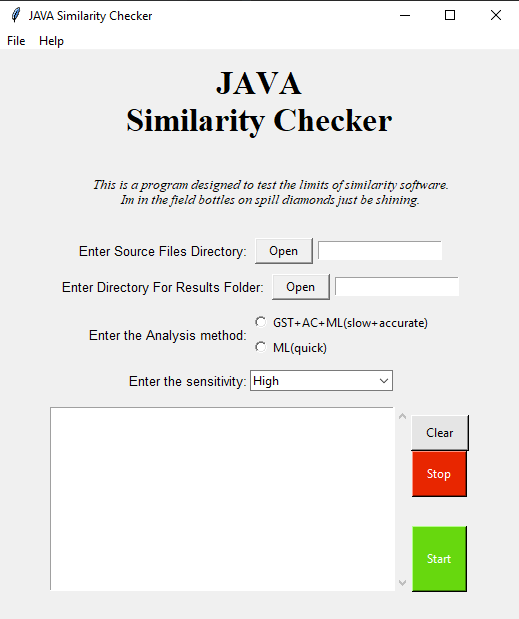
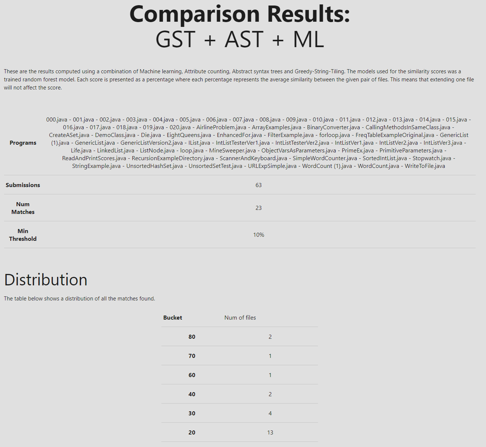
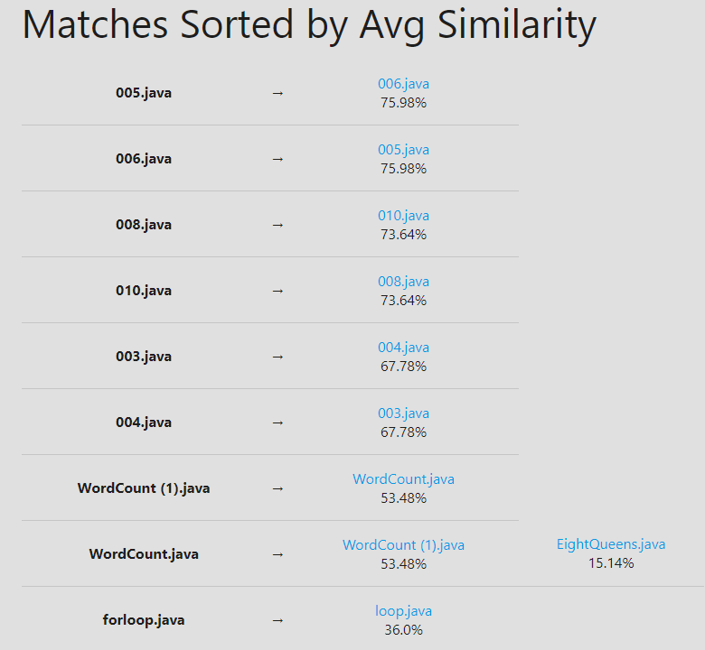
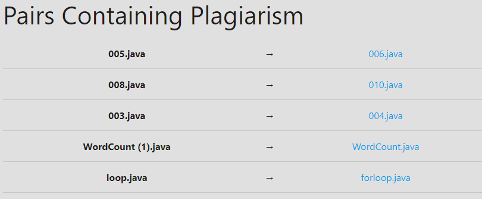
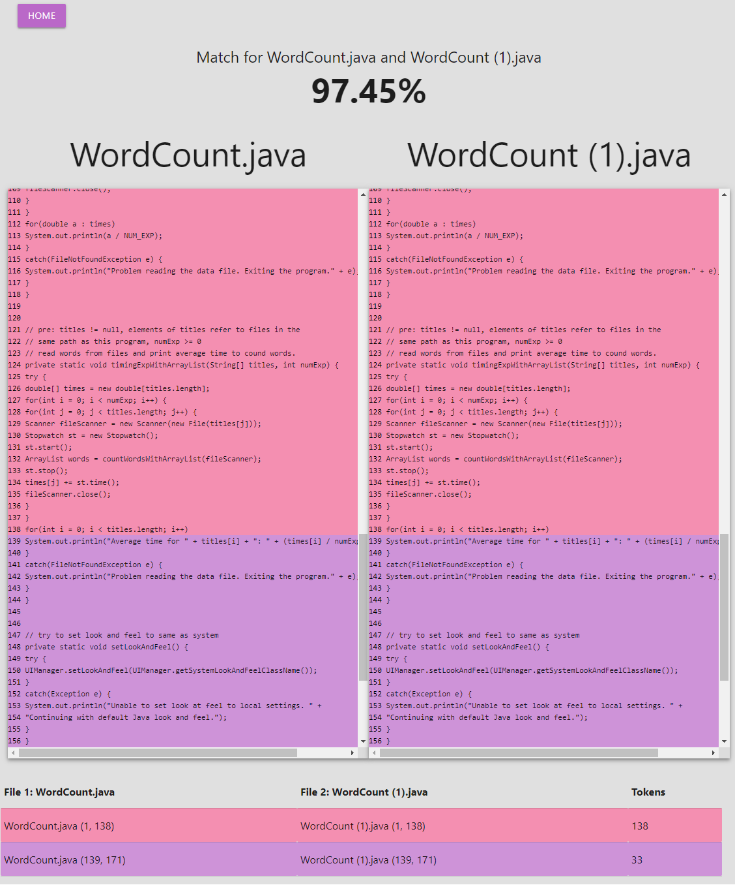

# Machine-Learning-Source-Code-Plagiarism

Using machine learning combined with attribute counting and structured based methods to obtain an accurate analysis of files for source code plagiarism
Utilises the [Rabin–Karp algorithm](https://en.wikipedia.org/wiki/Rabin%E2%80%93Karp_algorithm) and [AST's](https://en.wikipedia.org/wiki/Abstract_syntax_tree) for improved performance.

| | | |
|:-------------------------:|:-------------------------:|:-------------------------:|
|  |  |  |
|  |  | |

## Getting the Data

- The data to train this model was taken from the PAN 2014 dataset. This dataset is not included in this repository, but details around it can be found [here](https://pan.webis.de/clef14/pan14-web/plagiarism-detection.html)
- The actual data can be found [here](https://pan.webis.de/data.html#fire14-soco)
- You may have to request access to the data from the PAN organisers
- If you're not able to acquire from here please contact me and I'll share the data I have with you

## Running the Code

- The entry point is gui.py
- Please run these commands

```bash
# Make sure you're in the base directory first where the poetry.lock file is
poetry install
poetry shell
python scp/gui.py
```

- Note that if you're running this via ssh/wsl you will need to do extra steps to setup the GUI to display properly
